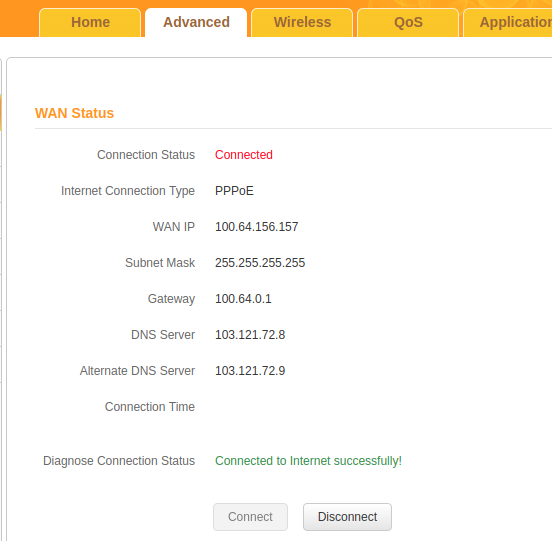
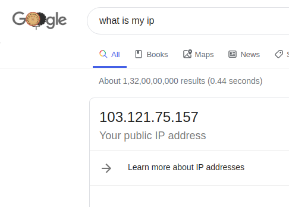

# Dynamic_DNS
A homemade Dynamic DNS tool for personal servers having dynamic IP.

The idea is to have a simple tool that serves the purpose of DDNS and help a personal server to be always accessible from internet, even when the ip changes. Also it should be open source and is available for free.

### How it works
A dynamic DNS host name or a domain name is linked up to the user's dynamic IP address. Whenever the IP changes, our dynamic DNS client will send an update to DDNS server with the current IP address and then the new ip is linked with your domain name. So whenever you access the ddns_server file using your domain name, it redirects the connection to the current Ip address of server. 

There are some tools available already for DDNS like no-ip, but none of them seemed to work for me. Since my server is connected to a router, and not directly to the WAN, the no-ip tool updates my masked ip on the no-ip servers everytime.

###### My WAN ip - 

  

###### What no-ip updates to their server - 

  

So to have a solution for this, I started building something of my own. 

The ddns_client.py script logs in into my Tenda WiFi router and scrapes out the current WAN ip assigned by the ISP.
It then sends the WAN ip to the ddns_server.php script on a web server. The scraping and ip sending process is performed in every 2-5 minutes. The IP is recieved by ddns_server.php file and is then updated into a text file stored into the same directory. The ddns_server script is alread linked with a Domain Name. So whenever the domain name is called, the ddns_server script reads back the ip text file and redirects the domain name to the current WAN ip. This is how, even after a new ip is assigned by my ISP, my server is still accessible.

This is just a basic solution that I found to solve the issue. If you have a better solution, your contributions are welcomed. 😊

#### Note -
The client script is built for Tenda routers. You'll have to change the URLs if your router is from a different manufacturer.
For Tenda stock firmwares, the default username is admin and password is encoded in base64 encoding. You'll need to change the login credentials with your's accordingly.
The ddns_client.py script should be scheduled to always run on the server.
